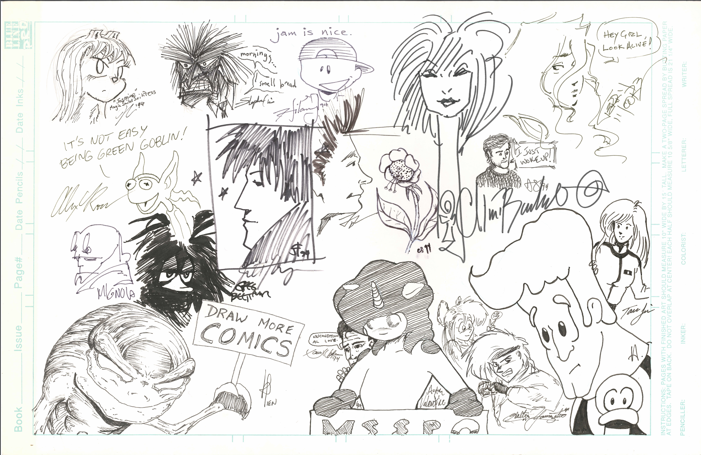

# Personal Info \(25%\)

You can find me publicly on [Twitter](https://twitter.com/iantien?lang=en) and [LinkedIn](https://www.linkedin.com/in/iantien/), I don't use Facebook much anymore. I tend to keep WhatsApp limited to people I intend to talk to.  

## BACKGROUND

Around the age of seven I wanted to be an artist making stamps because I thought stamps could be a high margin business. Stamps were tiny, the art wasn't amazing, and yet they sold for a lot of money relative to their size, and I thought I could make a much better product. My dad, who was a career engineer, disagreed and he thought I should instead learn a trade.   
  
This debate would continue for about a decade. During high school I published my own indie ashcan-sized comic book \(which was terrible\) and worked as a freelance storyboard artist \(which was not economically scalable\) and agreed with my dad that the economics in the creative industry weren't yet panning out for me.  

I agreed with my dad to postpone creative and entrepreneurial aspirations to study computer engineering at university so that I could learn a trade minimize the chances I would end up living in my parent's basement after graduation. During high school I'd learned to program in Prolog, Pascal and C++ and made my first very bad video game \(move your cursor to shoot bouncing circles until the program crashes\) so I had some background.  
  
I ended up with a degree in computer engineering and cognitive science and spent the back half of my academic degree building computer models of cognition in LISP. During university I worked at the Toronto Stock Exchange then E-Trade in Toronto, Canada; SpaceWorks in Rockville, Maryland; and then Trilogy in Austin, Texas. I specialized in front-end development and user experience design. Eventually I ended up at Microsoft building a new V1 product for Microsoft Office in scorecarding and dashboarding. Five years later I did my MBA in Silicon Valley and started a video game business from my dorm room. Interestingly, I did the bulk of the design work over the winter break holiday, when I was living in my parent's basement.

I ran the video game company profitably for three years before pivoting into the enterprise software company I run today. 

## INTERESTS

**Music** - Sunflower, High Hopes, Taylor Swift, Dido, BNL, Goo Goo Dolls  
**Movies** - MCU, Pixar/Disney Animation, Pitch Perfect series, most things Rebel Wilson  
**TV** - Big Bang Theory, Conan O'Brien, Brooklyn 99, Gordon Ramsey, The Newsroom, West Wing  
**Video** - YC Startup School, MasterClass   
**Twitter** - [Naval](https://twitter.com/naval), [Justin Kan](https://twitter.com/justinkan), [Paul Graham](https://twitter.com/paulg), [Garry Tan](https://twitter.com/garrytan), [Mark Brooks](https://twitter.com/MarkBrooksArt)  
**Comics** - Jim Lee, Mike Allred, Chris Bachalo

## NON-STANDARD EXPERIENCES 

### Respect for creatives 

I have tremendous respect for creatives. Before my career in software I worked as a freelance illustrator and storyboard artist, and as a background performer for [film](https://www.youtube.com/watch?v=EFGr2_cOOTk) and TV commercials. I was awestruck by the risk creatives were willing to take on in pursuit of their dreams. I've drawn on those experiences time and time again to be brave. 

### Easy on air travel 

I was once evacuated off a flight from EWR to SFO, where the engine caught fire on the runway. [You can read about the adventure on SF Gate](https://www.sfgate.com/bayarea/article/5-hurt-when-engine-on-SF-bound-plane-catches-fire-11168989.php).  Yes, I took the emergency slide. Was it fun? It's about as much as you can have running away from a flaming jet engine towards a concrete runway 20 feet below the plane. In general, I don't complain much about airplane delays, knowing that most of the time their priority is keeping everyone safe. 

